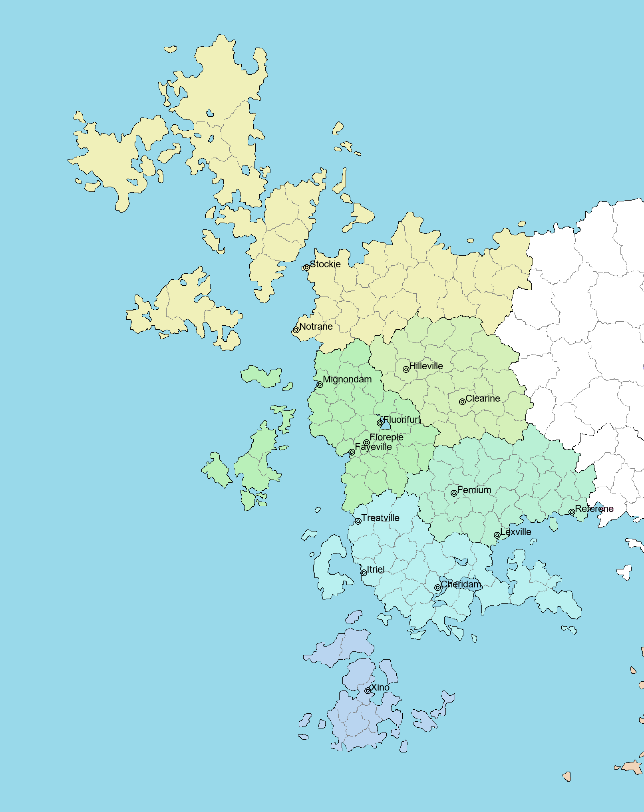

## 菲尔兰奇葩国王录-国王 Florent(Crafty 王国)

 0. Crafty 为 Fielland 历史上的一个王国，位于 Fielland 西海岸，在相当长的一段时间内为 Fielland 列岛里最强大的国家。

1. Florent 于 1324 年 7 月出生于花原琉璃宫（Crafty 宫廷）；Florent 于 1345 年 9 月登基，时年 21 岁，因已成年所以直接亲政；Florent 于 1348 年 8 月因失败的 srs 手术去世，时年 24 岁，一共统治 Crafty 2 年 11 个月。
2. 作为王室长子以及第一继承人，Florent 从小就表现出女性化的特质，被旁人认作女孩子，在 12 岁时开始穿女装，将自己打扮成女孩子，但是别人问他是否想跨性别的时候，他说不想，他只是一个 femboy。Florent 快满 15 岁时，其父驾崩，虽然他是太子，但是议会众臣不同意让一个“女性化的孩子继承大统”，于是扶其 13 岁的次弟上位。Florent 因为突然的变故得上抑郁症。在 Florent 15-21 岁期间，四个弟弟接连上位但都提前夭折。在此期间，Florent 将自己打扮得越来越女性化，外人看来完全是一个女孩子，甚至在贵族圈子里吸引了很多追求者。其声音也保持在类似女声的样子，原因至今成谜。朝廷里的人问 Florent，他就说这么做只是为了缓解压力，他真的只是一个 femboy，不想变性。1345 年 9 月 Florent 的最小的一个弟弟驾崩，王室里除了他已经没有男性继承人了，再加上他保证自己不变性，议会众臣无奈推举他上位。1346 年 3 月，Florent 突然宣布自己是 MtF，要把她作为女孩子对待，并要给自己做 srs，从菲尔兰各地寻找最好的医师筹划方案。1348 年 8 月，手术进行，但途中大出血没有止住，结束了国王 Florent 三年的血腥统治。
3. Florent 虽然只在位将近三年，但是对 Crafty 王朝的制度做了许多大的改动，尽管死后因为各地叛乱重新洗牌很多制度又恢复了回去，但是依然对 Crafty 以及后世的 Fielland 产生了不可磨灭的影响。Florent 规定全国范围内女性获得和男性同等的参政权利，废 ff 除男性特权。朝廷和议会都新增了大量女性官员。Florent 认可了跨性别者的身份认同，允许跨性别者使用自己认同的社会性别身份。Florent 计划在全国各郡都建立起朝廷直属的雕版印刷厂，用于宣传自己的画像和诏令，但是由于经济原因只完成了不到一半。Florent 进行货币改革，统一了阿尔贞银币的大小，推行王国钱币替代诸侯国的钱币。
4. Crafty 宫廷在 Florent 16-19 岁时给 Florent 找了 3 个妃子，结果 3 个妃子都以“不想嫁给一个女孩子”为由离去，这件事情对 Florent 造成了很大的心里创伤。Florent 登基后，把三个人都抓起来关进大牢了，理由是“为什么不喜欢我”。
5. 在 Florent 在位期间的 1347 年，下辖的 Shamet 王国（别问为什么王国能下辖王国，菲尔兰的封建制度乱得很，尤其是较晚开发的”野蛮生长“的西部）发动叛乱，叛乱到 Florent 死时仍未平息。Shamet 国王以“想娶 Florent 为妻但是 Florent 拒绝了”为由发动叛乱，但是后来被验证为应该只是一个借口，真实原因是 Florent 废除男性特权导致当地贵族极为不满，密谋除掉 Florent 恢复只有男性才能参政的制度。Florent 死后，Crafty 王室绝嗣，Crafty 各路诸侯贵族陷入吃鸡大战，最后选出来了一个新王室。吃鸡大战期间，Shamet 王宫被攻陷，发现里面到处都贴着 Florent 的画像，而 Shamet 国王的寝室内就有好几张不同版本的。
6. Florent 命令开办了菲尔兰第一家精神病院，其中第一个患者就是 Florent。Fielland 统一后，该床位被搬至院史展览区，用来纪念 Tecna Florent（还有就是因为忌讳（？））
7. 在 Florent 的手稿里发现，Florent 非常喜欢二进制，并且似乎在设计一种二进制计算器，用连线表示信号传输，方块表示非门，并联表示或门，但是后来因为抑郁症的原因她并没有设计完就放弃了。并且也没有找到如何实现这些门电路的资料。手稿中发现她已经搓出了加法器，但是对如何表示负数以及算减法一直犹豫不决。据历史学家研究她似乎是在皇家学院上课开小差的时候画的。
8. Florent 在皇家学院上学时，老师布置的任务经常不做，问就是玩嗨了没时间。每次老师追责她就在老师面前扮可爱，然后老师就心软了。其他王室孩子问“为什么 Florent 不做就不用受到惩罚”老师就说”你长得有他那么可爱吗？“ 其实那些老师都是害怕 Florent 将来当国王了收拾他，果不其然 Florent 登基之后把她幼年时一个惩罚过她的老师打的半死。
9. Florent 在得抑郁症之前为人非常的和善，给人感觉总是软软糯糯的，但是 14 岁抑郁发作之后就开始喜欢玩 SM，一般流程是这样的：一开始她先是抱着她的宫廷亲友（大部分是男性），非常温柔地抚摸，让对方把头埋进她头发里，等对方完全放松之后突然推倒对方，然后对对方拳打脚踢，有时候还压在对方身上打。有一次她跟当时做国王的三弟玩，把他打进皇家医院了，然后自己被侍卫拖走关押起来。当时的国王想处罚 Florent，但是无奈自己太小没亲政无法下达诏令。摄政王去看 Florent 的时候，Florent 在他面前流泪，然后还伸出手表示想抱抱，摄政王看她很可怜，就抱了她（没有后续的流程），把她放出来了。结果这件事传出去之后，一堆的宫廷贵族朋友找她表示想玩
10. 有传言说，有一位刺客尝试过刺杀 Florent。被 Florent 知道之后派人调查，调查到 ta 有 mtf 倾向，于是承诺在自己做完 SRS 后给 ta 免费做 SRS，要求是被软禁，结果 ta 同意了。但是 Florent 在 SRS 手术中不幸驾崩
11. Florent 命令在国都建设 SM 广场，但对外宣称是用 10^9 命名
12. Florent 发行的阿尔贞银币比之前的轻，并且非常薄，导致直径还比之前还大。Florent 靠这种方式在全国搜刮了巨额财产，维持自己奢华的生活。Crafty 宫廷原本是较为简朴的，自从 Florent 之后就变得越来越奢靡，变得岛内外闻名。因为现实里的 Florent 没有经历过所以写不出来究竟是怎样的。Florent 将一些原本为常见材质的家具、器具全部更换，要求工匠利用珍惜材质制造当时难以制造的外形与细节，Florent 扩建了琉璃宫，造了一处专门供自己玩乐的区域，其中包含一些人工加热的温泉。Florent 版阿尔贞银币上有些是她的头像，有些是她的全身像，这种币虽然价值较之前低但是因为能看到 Florent 的美貌所以很受大家的欢迎，全国各地都很积极地换新币。
13. 菲尔兰语 Crafty 方言曾经人称是分性别的，有他 sim 和她 sif。Florent 从小就经常被叫成 sif，但是她自己非常开心会被这么叫，每当大人站出来纠正她是 sim 的时候，她反而不开心。Florent 登基之后，废除了人称的性别区分，统一叫 si.
14. 后人在 Florent 的寝室的床底下发现了 120 封写给她的情书，她虽然没有回应这些情书，但是将其保存的特别好。其中 98 封是男性写给她的，只有 22 封是女性写给她的。
15. Florent 非常喜欢甜食，但是又怕长胖，于是经常吃了甜食就不吃饭了。Florent 非常在意自己的身材，经常去绕城走（走一圈大概要 3 个小时）然后回宫之后吃甜食。
16. Florent 在位期间 Crafty 是整个菲尔兰最集权的国家（虽然也不怎么集权），Florent 在那个时候是菲尔兰有史以来权力最大的人，达到了菲尔兰历史上的巅峰。但这并不是因为她本人执政手段有多高明，而是因为在她之后 Crafty 陷入吃鸡大战，大战结束后新王室需要从头开始集，导致集权程度较 Florent 时期降低，所以 Florent 时期是巅峰...
17. 在皇家学院学剑术的时候，老师说”Florent 你可以不用上这个课“ Florent 说”我又不是拿不动剑为什么不能上“ 老师说”害怕伤害到你“ 但是 Florent 执意要上。结果有一次老师说的话比较粗鲁（是对所有学生而不是 Florent 一个人）Florent 听了生气了，从背后偷袭把老师推倒然后压在他身上乱砍，把老师盔甲砍破了让他受了伤。
    （持续更新中）
