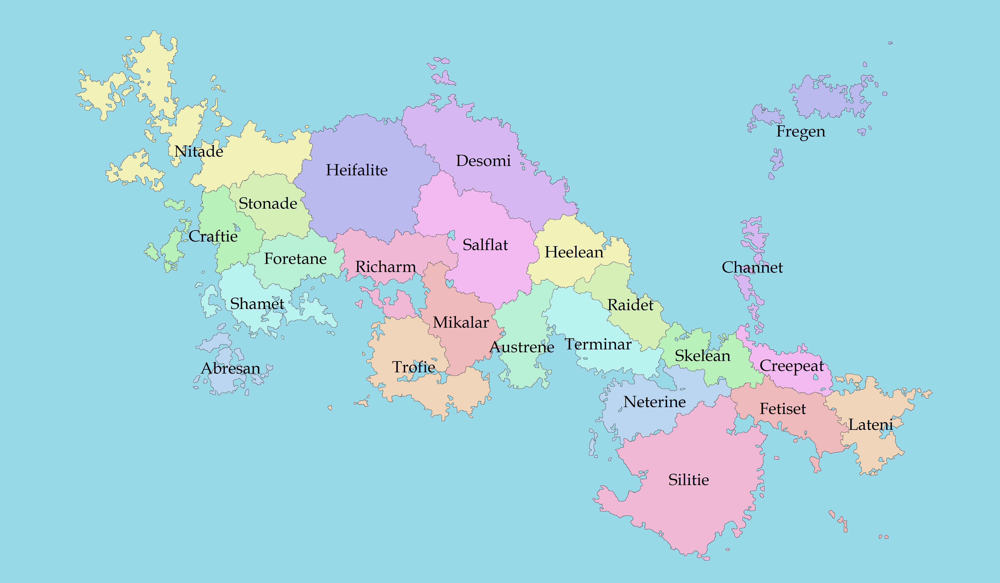

Fielland（菲尔兰）是我（Florent）设计的一个虚拟国，总面积约 **3,400,000** km2，总人口约 **138,000,000** 人。该国位于一个架空世界里，而该架空世界是一个平行地球，恒星系各大天体的运动规律等都和太阳系一致，但是该平行地球的海陆分布和地球相比略有不同，可以看成地球的魔改，以适配 Fielland 的加入。
Fielland 整体为一群岛，位于约 40°N~65°N，相当于地球上欧洲以西大西洋的位置，因此算作欧系的国家，属于欧洲文明的次生文明（可以参考中原王朝和日本的关系），文化主要吸收欧洲的特点，但又有自己的独立性（Florent 才不会说往里面夹了世界各地的私货呢）。
Fielland 为科技高度发达的国家，尤以信息技术、化学、制药为突出点，社会保障体系亦极度发达，高于北欧的水平。对于少数群体（如 LGBTQ+、神经多样性人士）非常包容并提供实质有用的支持。同时 Fielland 的文化本身就较为技术崇拜，因此科技从业人员比例极高。
Fielland 的本土宗教为一种名为“枝教”（Branchism）的多神教，该宗教认为世间万物由一棵“世界树”不断分枝生长而来，世界的基本结构是树状的。同时枝教亦信仰万物有灵，建有海量神社祭拜万物，认为这种祭拜是让人与世界建立联系的一种手段。

Fielland 国旗：
Fielland 地图：
Fielland 人口统计（2020 年人口普查）:

| Number    | State        |      Population |
| --------- | ------------ | --------------: |
| 1         | Nitade       |       7,907,281 |
| 2         | Stonade      |       8,786,854 |
| 3         | Craftie      |      15,772,153 |
| 4         | Foretane     |      10,496,407 |
| 5         | Shamet       |      12,113,220 |
| 6         | Abresan      |       2,579,563 |
| 7         | Heifalite    |       1,299,010 |
| 8         | Desomi       |       1,084,509 |
| 9         | Salflat      |       2,018,826 |
| 10        | Richarm      |       7,854,218 |
| 11        | Mikalar      |       8,105,782 |
| 12        | Trofie       |       6,877,631 |
| 13        | Heelean      |       2,156,259 |
| 14        | Raidet       |       3,447,207 |
| 15        | Skelean      |       6,444,972 |
| 16        | Austrene     |       5,286,029 |
| 17        | Terminar     |      10,177,384 |
| 18        | Neterine     |       7,301,730 |
| 19        | Fregen       |       1,326,244 |
| 20        | Channet      |       1,432,330 |
| 21        | Creepeat     |       4,268,333 |
| 22        | Silitie      |       4,114,887 |
| 23        | Fetiset      |       3,577,438 |
| 24        | Lateni       |       3,721,385 |
| **Total** | **Fielland** | **138,149,652** |
